# Database ER Diagrams - Alf.io

This document contains Entity-Relationship diagrams for the Alf.io database schema using Mermaid notation.

---

## Complete Schema Overview

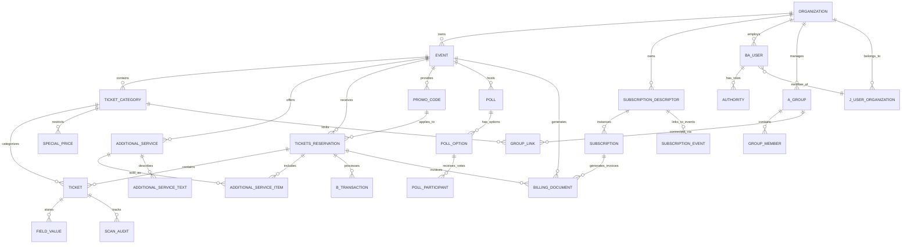

---

## Core Event Management

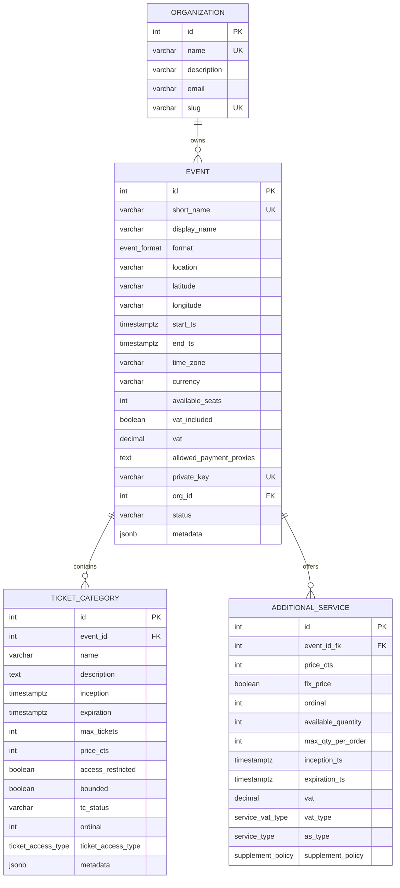

---

## Reservation & Ticketing

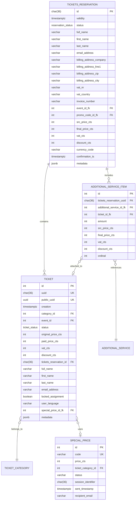

---

## Payment & Billing

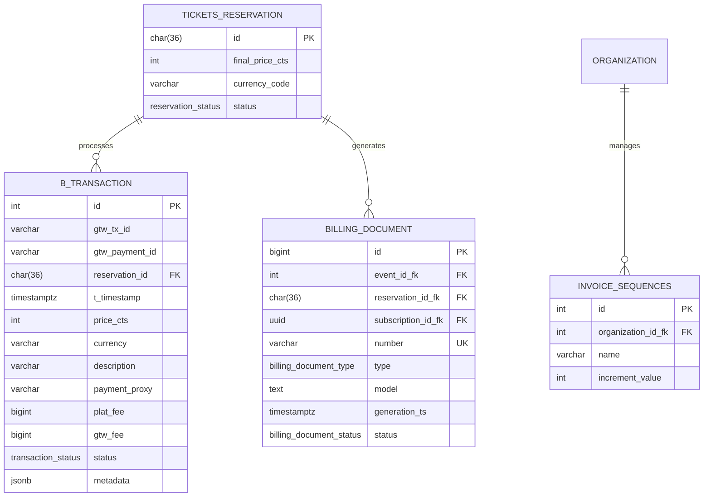

---

## Subscription Management

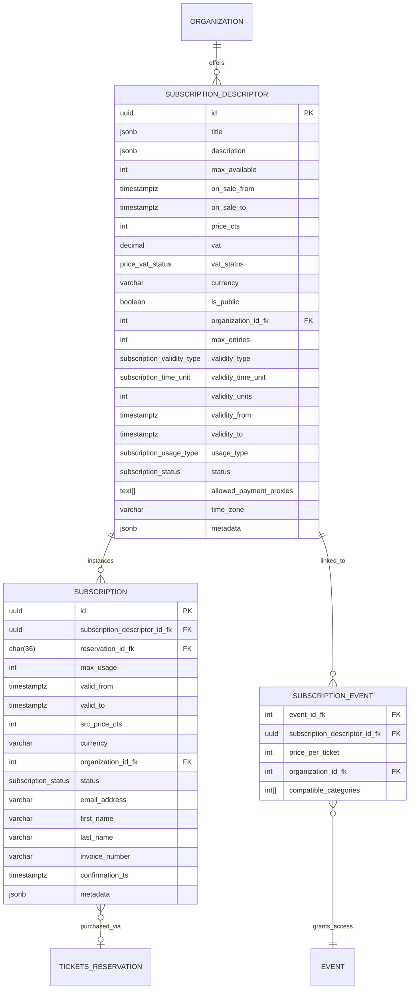

---

## User & Access Control

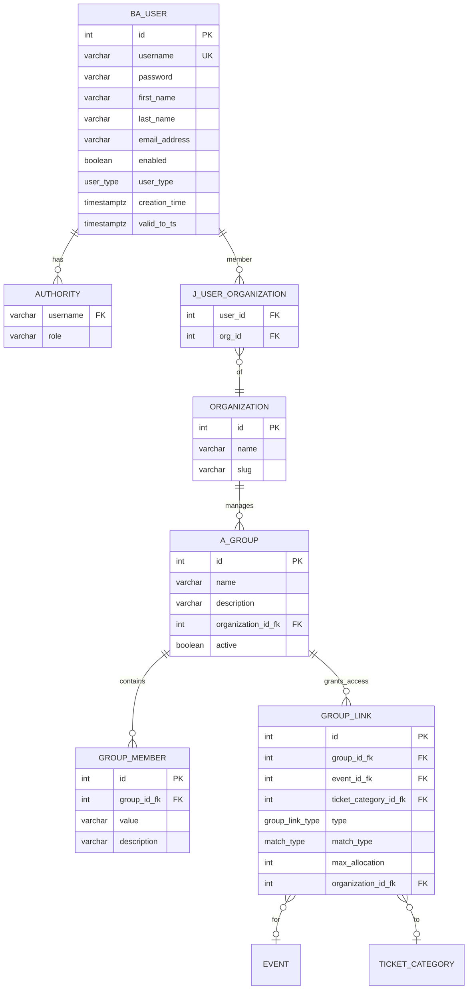

---

## Promo Codes & Special Pricing

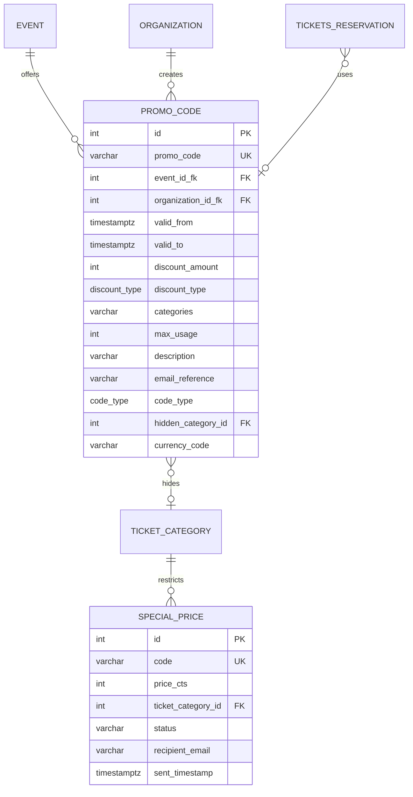

---

## Audit & Tracking

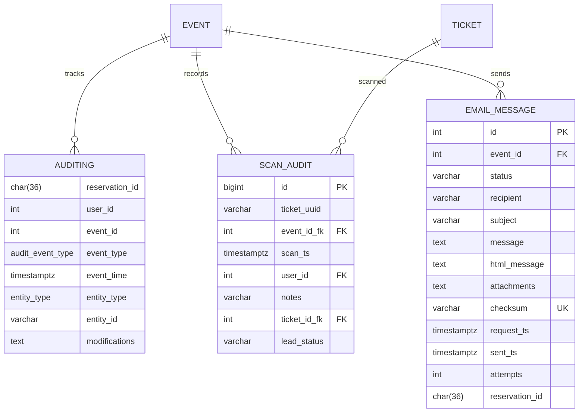

---

## Configuration & Customization

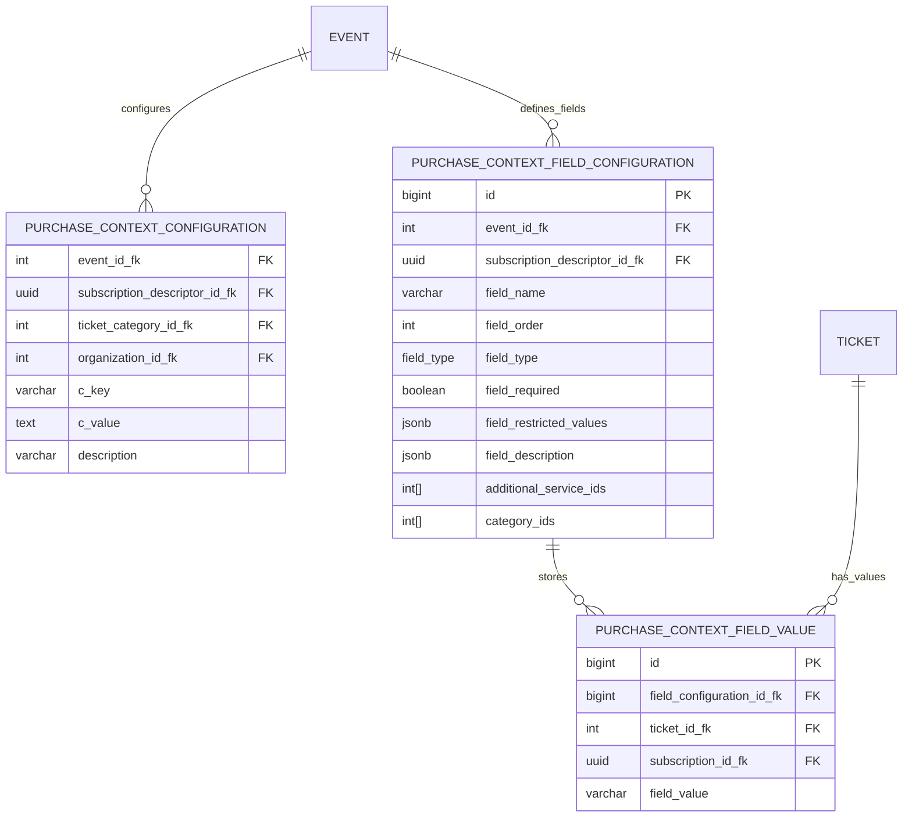

---

## Polls

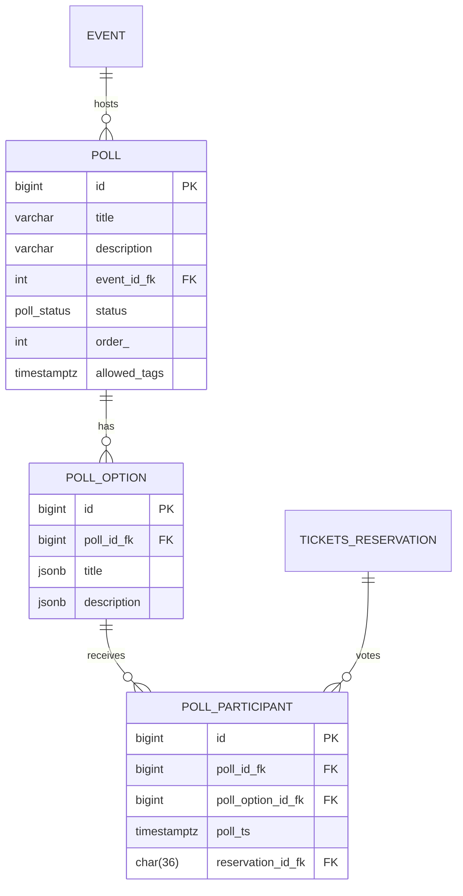

---

## File & Resource Management

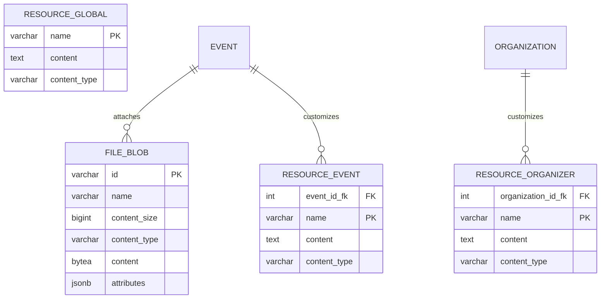

---

## Extension System

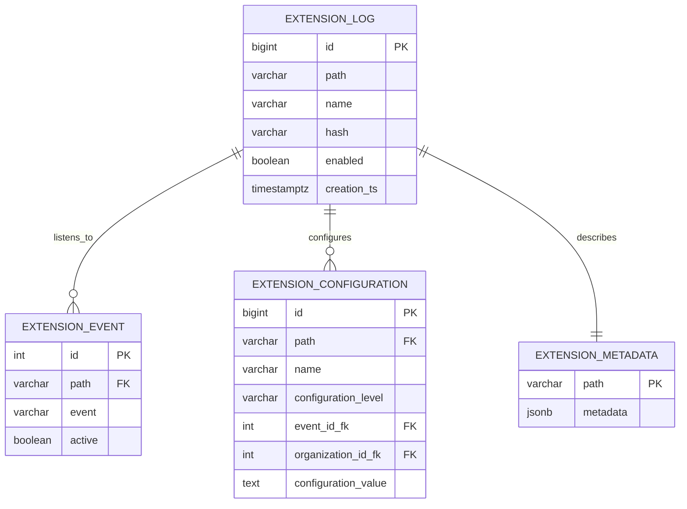

---

## Admin Job Queue

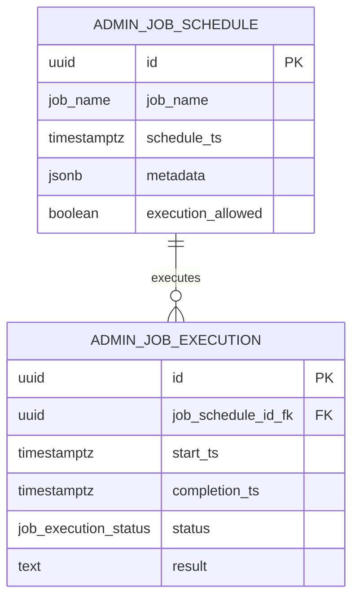

---

## Data Types (Enums)

### Event & Ticket Types

| Type | Values |
|------|--------|
| **event_format** | IN_PERSON, ONLINE, HYBRID |
| **ticket_status** | FREE, PENDING, ACQUIRED, TO_BE_PAID, CHECKED_IN, CANCELLED, RELEASED, INVALIDATED, EXPIRED |
| **reservation_status** | PENDING, IN_PAYMENT, EXTERNAL_PROCESSING_PAYMENT, OFFLINE_PAYMENT, DEFERRED_OFFLINE_PAYMENT, COMPLETE, STUCK, CANCELLED, CREDIT_NOTE_ISSUED |
| **ticket_access_type** | IN_PERSON, ONLINE, INHERIT |

### Billing Types

| Type | Values |
|------|--------|
| **billing_document_type** | INVOICE, RECEIPT, CREDIT_NOTE |
| **billing_document_status** | VALID, NOT_VALID |
| **transaction_status** | PENDING, COMPLETE, FAILED, CANCELLED |

### Subscription Types

| Type | Values |
|------|--------|
| **subscription_status** | ACTIVE, NOT_ACTIVE |
| **subscription_validity_type** | STANDARD, CUSTOM, NOT_SET |
| **subscription_time_unit** | DAYS, MONTHS, YEARS |
| **subscription_usage_type** | ONCE_PER_EVENT, UNLIMITED |

### Service Types

| Type | Values |
|------|--------|
| **service_type** | DONATION, SUPPLEMENT |
| **service_vat_type** | INHERITED, NONE, CUSTOM |
| **supplement_policy** | MANDATORY_ONE_FOR_TICKET, OPTIONAL_UNLIMITED_AMOUNT, OPTIONAL_MAX_AMOUNT_PER_TICKET, OPTIONAL_MAX_AMOUNT_PER_RESERVATION |

### Pricing Types

| Type | Values |
|------|--------|
| **price_vat_status** | INHERITED, NOT_INCLUDED_NOT_CHARGED, NOT_INCLUDED, INCLUDED, INCLUDED_EXEMPT, NONE, CUSTOM_INCLUDED, CUSTOM_EXCLUDED, CUSTOM_INCLUDED_EXEMPT |
| **discount_type** | PERCENTAGE, FIXED_AMOUNT, FIXED_AMOUNT_RESERVATION, NONE |
| **code_type** | DISCOUNT, ACCESS, DYNAMIC |

---

**Documentation Version**: 1.0  
**Last Updated**: February 12, 2026  
**Database Version**: 2.0.0.60+

