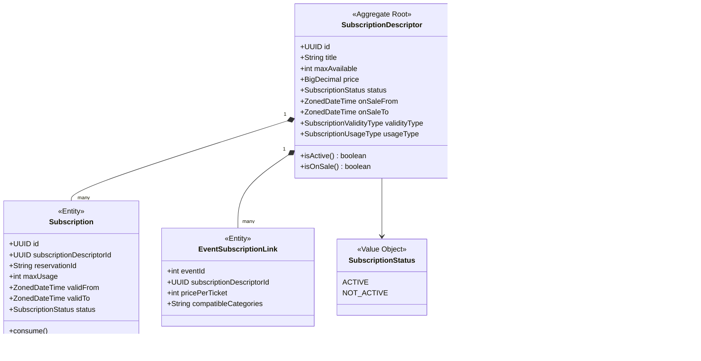

# DDD Visual Diagrams - Alf.io

## 1. Bounded Context Diagram

## 2. Event Management Aggregate

## 3. Reservation Aggregate

## 4. Subscription Aggregate

## 5. Organization Aggregate

## 6. Transaction Flow Diagram

## 7. Reservation State Machine

## 8. Ticket State Machine

## 9. Event Lifecycle

## 10. Payment Processing Flow

## 11. Check-In Process

## 12. Promo Code Application

## 13. Extension System Architecture

## 14. Database Schema Overview

## 15. Layered Architecture

---

**Diagrams Version**: 1.0  
**Last Updated**: February 12, 2026  
**Format**: Mermaid.js (compatible with GitHub, GitLab, Obsidian, etc.)

